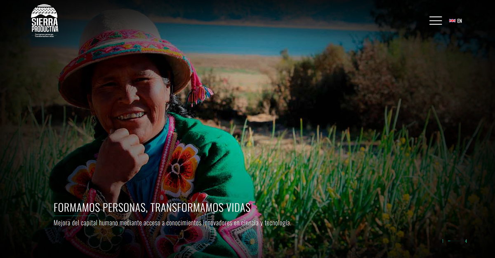
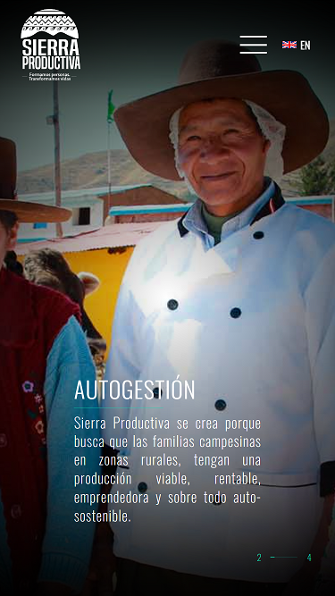
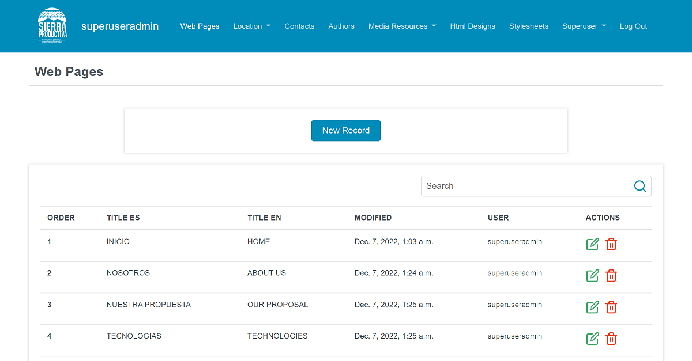
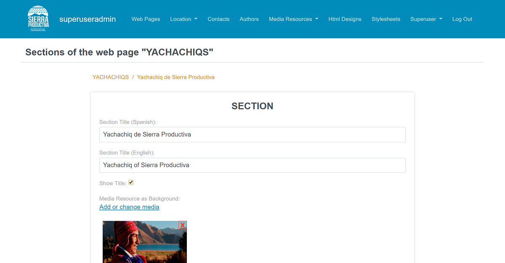

# sp-website
Sierra Productiva is a website whose main goal is to convey the importance of a Development Proposal called Sierra Productiva. This proposal seeks to guide the development of poor small farmers to improve the productivity of their family farms through the incorporation of productive technologies. This improvement will allow them to become small entrepreneurs, and thus overcome poverty.

## Features

- The website is composed of two applications: appManageWSSP and appDisplayWSSP.
- AppManageWSSP is a content management that allows the admin user to manage all database information, which will be displayed on the appDisplayWSSP.
  - It allows admin user create, edit, and delete the website pages and their content such us section, descriptive articles, graphic articles, sliders, stylesheets, etc.
  - Admin the countries.
  - Admin the Peru's regions, provinces, and districts.
  - Admin the media resources like images and videos.
  - Admin the third party articles about Sierra Productiva.
  - List the contact emails sent from the official website.
  - The super user can manage the admin users information.
- AppDisplayWSSP retrieves all the database information to dynamically builds the Sierra Productiva oficial website.
  - This app displays the information in two languages Spanish and English.

## Live demo

[http://ec2-52-91-164-80.compute-1.amazonaws.com/](http://ec2-52-91-164-80.compute-1.amazonaws.com/)

## Built With

- Python
- Django
- JavaScript
- SCSS
- Postgresql
- Docker

## Getting Started

To get a local copy up and running follow these simple example steps.

### Prerequisites

- Have `git` installed on your local computer.
- Have `docker` and `docker compose` installed on your local computer.

### Install

- Run the commant `git clone git@github.com:gabyse1/sp-website.git` or `git clone https://github.com/gabyse1/sp-website.git` to clone this repository to your local computer. Choose the location you prefer.
- Run the command `docker compose build` to build the project image and install all the project's dependencies.

### Usage

- Run the command `docker compose up -d` to run the project.
- Restore the database backup.
- Open the url `http://127.0.0.1` on a browser to visualize the oficial website.
- Open the url `http://127.0.0.1/manage/index` on a browser to access to the content management.

## Authors

👤 **Gabriela Sánchez Espirilla**

- GitHub: [@gabyse1](https://github.com/gabyse1)
- LinkedIn: [gabyse](https://www.linkedin.com/in/gabyse/)
- Twitter: [@gse_sd](https://twitter.com/gse_sd)

## 🤝 Contributing

Contributions, issues, and feature requests are welcome!

Feel free to check the [issues page](../../issues/).

## Show your support

Give a ⭐️ if you like this project!

## 📝 License

This project is [MIT](./LICENSE) licensed.
